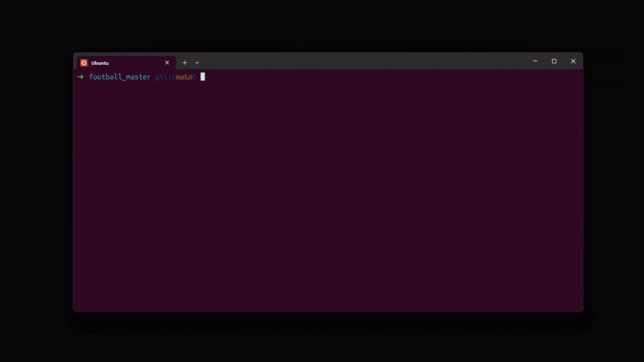
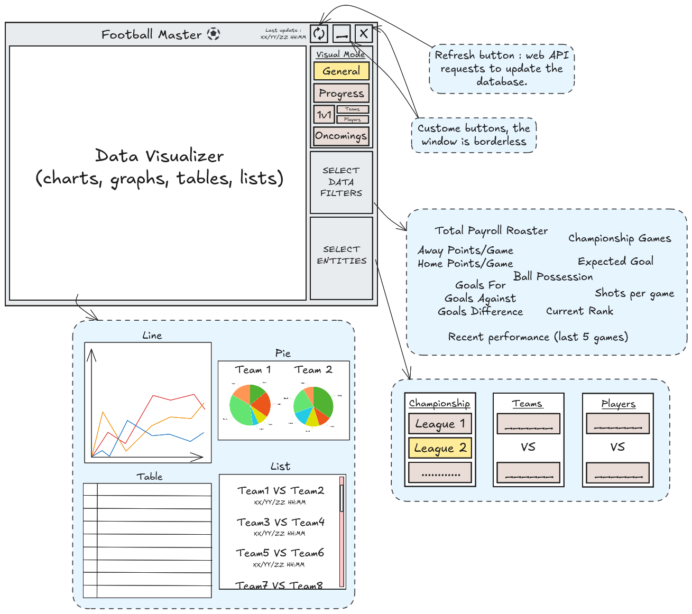

# Football Master




> Aperçu animé de l'application Qt Football Master



> Schéma de l'interface utilisateur principale


## Architecture & Interactions


**Fonctionnement global :**
- Démarrage des services Docker (DB, Scraper, Qt)
- Le Scraper collecte et insère les données dans la DB
- L'application Qt lit, analyse et affiche les données


## Quick Start

1. Configurez votre fichier `.env` (voir exemple ci-dessous)
2. Démarrez tous les services :
	```sh
	make up
	```
3. Build l'application Qt :
	```sh
	make build
	```
4. Lancez l'application Qt (avec X11 forwarding si besoin) :
	```sh
	make run
	```

## Structure du projet

- `db/` : Initialisation et données de la base PostgreSQL
- `scraper/` : Scraper Python (Flask, requests, BeautifulSoup, psycopg2)
- `qt/` : Application Qt/C++ (analyse et visualisation)

## Exemple de fichier .env

```
DB_USER=football_user
DB_PASSWORD=football_pass
DB_NAME=football_db
PROJECT_NAME=football_master
EXECUTABLE=football_master
```


## Requirements

- Docker
- Make
