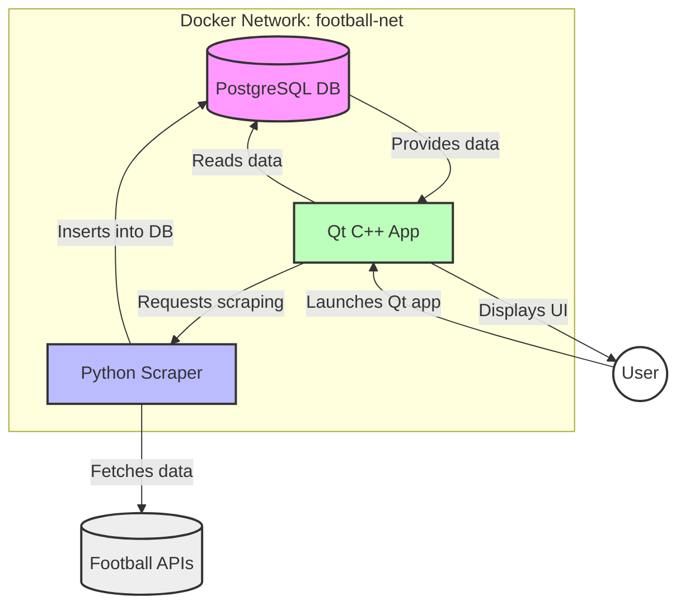

# Football Master


> Animated preview of the Qt Football Master application


> Main user interface diagram


## Architecture & Interactions



**Global workflow:**
- Start Docker services (DB, Scraper, Qt)
- Scraper collects and inserts data into the DB
- The Qt application reads, analyzes, and displays the data


## Quick Start

1. Configure your `.env` file (see example below)
2. Start all services:
    ```sh
    make up
    ```
3. Build the Qt application:
    ```sh
    make build
    ```
4. Run the Qt application (with X11 forwarding if needed):
    ```sh
    make run
    ```


## Project Structure

- `db/` : PostgreSQL initialization and data
- `scraper/` : Python scraper (Flask, requests, BeautifulSoup, psycopg2)
- `qt/` : Qt/C++ application (analysis and visualization)

## Example .env file

```
DB_USER=football_user
DB_PASSWORD=football_pass
DB_NAME=football_db
PROJECT_NAME=football_master
EXECUTABLE=football_master
```


## Requirements

- Docker
- Make
