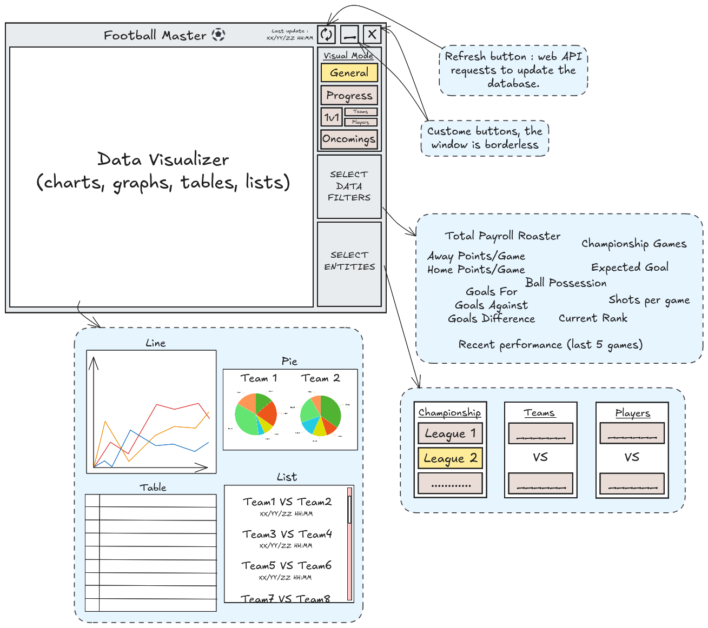

# Football Master  
This repository is dedicated to building a football master project with Qt C++ framework. It aims to explore data collection, analysis, and visualization techniques related to football, with the long-term goal of providing insights such as player statistics, team performance, and match dynamics.

It is structured to facilitate modular development, with web API integration to stay up-to-date with real-time football data.

## UI Diagram

## Development Status  

🚧 Project currently in **active development**. Initial focus: architecture design and workflow definition.  

## Requirements  

- Docker
- Make

## Building and Testing Environment  
- Containerized environment using Docker for consistent builds and dependencies.
